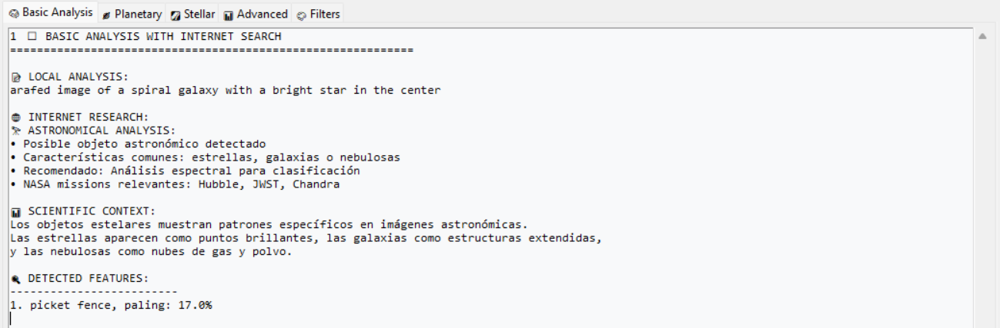
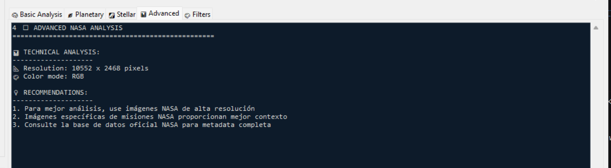

# 🌌 NASA Multi-Mission Image Explorer - Scientific Platform


Una plataforma científica avanzada para análisis y exploración de imágenes multidimensionales de la NASA con capacidades de IA integradas.

---

## 🚀 Características Principales

### 🔬 Análisis Científico Avanzado
- Procesamiento de imágenes con **15+ filtros OpenCV especializados**  
- **Detección de patrones automática** (círculos, contornos, líneas, rectángulos)  
- Análisis espectral con detección de **rangos de color específicos**  
- Sistema de **teselas para manejo eficiente de imágenes de alta resolución**  
- Herramientas de medición y anotaciones científicas  

### 🤖 Inteligencia Artificial Integrada
- Análisis automático con modelos **BLIP** y **ResNet-50**  
- **Descripción automática de imágenes** generada por IA  
- Clasificación de características y detección de objetos  
- **Búsqueda contextual** en internet para análisis enriquecido  

### 🎨 Interfaz Profesional
- Sistema de **capas y filtros en tiempo real**  
- Zoom avanzado con navegación suave  
- Pestañas de análisis especializado  
- Panel de control personalizable  

---

## 📸 Galería de Funcionalidades

### 🖼️ Visualización y Navegación
> Zoom dinámico hasta 1000%, navegación por teselas y sincronización entre vistas.

### 🎛️ Panel de Control Científico
> Filtros en tiempo real, ajuste de color, contraste y saturación profesional.

### 🔍 Detección de Patrones
> Análisis de círculos, contornos, líneas y geometrías espaciales.

### 🌈 Análisis de Color
> Seis rangos espectrales con estadísticas detalladas y máscaras individuales.

### 📊 Análisis con IA
> Clasificación automática, búsqueda contextual y recomendaciones científicas.

---

## 🧩 Galería de Imágenes

| Imagen | Qué se puede analizar o apreciar (en términos astronómicos) |
|:--|:--|

|  | Imagen de referencia científica de la **Galaxia de Andrómeda (M31)**. Permite observar **la estructura espiral, el núcleo brillante, y las zonas de formación estelar** (visibles como regiones azuladas). Es útil como base para aplicar análisis multiespectral o con IA. |
|  | El aumento de contraste ayuda a distinguir **estructuras finas** dentro de nebulosas o galaxias (por ejemplo, los brazos espirales o los bordes de una nebulosa oscura). También permite resaltar **regiones con diferente densidad de gas y polvo interestelar**. |
|  | El filtro amarillo se usa para **simular la luz de estrellas tipo G** (como el Sol). En astrofotografía, este filtro permite estudiar **zonas de temperatura intermedia (~5,500 K)** y obtener una visión más realista del color natural de muchas estrellas. |

|  | El filtro azul resalta **estrellas muy calientes** (tipo O y B, >10,000 K) y **regiones jóvenes de formación estelar**, ya que el gas ionizado emite fuerte en longitudes de onda cortas. También es útil para estudiar cúmulos jóvenes y brazos espirales activos. |
|  | La conversión a blanco y negro elimina la distracción del color y permite analizar **la luminosidad pura**. Es ideal para medir **la magnitud aparente, el brillo superficial o la fotometría** de estrellas y galaxias. |
|  | La detección de bordes (edge detection) se usa para **resaltar los límites estructurales**, como los bordes de cráteres lunares, las fronteras de nebulosas o los anillos de Saturno. Permite identificar formas geométricas y contrastes estructurales. |
|  | Al aumentar el brillo, se pueden revelar **regiones débiles o poco iluminadas**, como **colas de cometas, halos galácticos o nebulosas difusas** que normalmente no se perciben en imágenes normales. |
|  | Es una **combinación de varios filtros** (color, contraste, luminosidad). Permite realizar un **análisis multiespectral**, similar al que usan telescopios como el Hubble, para combinar distintas longitudes de onda y obtener una visión más rica del objeto. |
|  | La ecualización de histograma redistribuye los tonos para revelar **detalles ocultos en zonas muy claras o muy oscuras**, lo que es muy útil en imágenes de **superficies planetarias o cúmulos estelares** donde hay alto rango dinámico. |
|  | El modelo HSV (Tono, Saturación, Valor) permite analizar la imagen **por componentes de color y brillo**, lo que ayuda a distinguir **diferencias espectrales** o zonas con distinta emisión de energía. Es útil para mapear **temperaturas o composiciones**. |
|  | Este representa la salida de un modelo de **inteligencia artificial (como BLIP o CLIP)** que describe automáticamente lo que ve. Sirve para **clasificar objetos astronómicos**, identificar galaxias, nebulosas o estrellas sin intervención humana. |
|  | Un análisis IA avanzado que puede **detectar y clasificar tipos de objetos** (por ejemplo, si es una nebulosa de emisión, una galaxia espiral, un cúmulo globular, etc.), usando redes neuronales entrenadas con catálogos astronómicos. |
|  | El filtro naranja simula estrellas tipo K, **más frías que el Sol (~4,000 K)**. Permite observar mejor **regiones de polvo o estrellas en envejecimiento**, como gigantes rojas o regiones de baja energía. |
|  | El negativo invierte los valores de brillo: las zonas oscuras se vuelven claras y viceversa. En astronomía se usa para **resaltar contrastes finos** o **identificar detalles débiles** en el fondo del espacio que normalmente se pierden. |


---

## 🛠️ Instalación

### 📋 Requirements (`requirements.txt`)

```
# Core Dependencies
python>=3.8
opencv-python>=4.8.0
numpy>=1.24.0
pillow>=10.0.0
matplotlib>=3.7.0

# AI and Machine Learning
torch>=2.0.0
transformers>=4.30.0
tokenizers>=0.13.0

# GUI and Interface
tkinter>=8.6
customtkinter>=5.2.0

# Image Processing
scikit-image>=0.21.0
imageio>=2.31.0

# Web and Data
requests>=2.31.0
beautifulsoup4>=4.12.0
urllib3>=2.0.0

# Utilities
threading>=3.0
datetime>=4.0
json>=2.0.0
os-sys>=2.0.0 ´´´

```

## Instalación Paso a Paso

```
# Clonar el repositorio
git clone https://github.com/tu-usuario/nasa-image-explorer.git
cd nasa-image-explorer

# Crear entorno virtual
python -m venv nasa_env
# Activar entorno
source nasa_env/bin/activate  # Linux/Mac
nasa_env\Scripts\activate     # Windows

# Instalar dependencias
pip install -r requirements.txt

# Verificar instalación
python -c "import cv2, tkinter, torch; print('✅ Instalación completada exitosamente')"

```

## 🌟 Tipos de Estrella según el Color
Tipo espectral	Color aparente	Temperatura (K)	Ejemplo
O	🔵 Azul	30,000 – 50,000	ζ Puppis
B	🔷 Azul-blanco	10,000 – 30,000	Rigel
A	⚪ Blanco	7,500 – 10,000	Sirio
F	🟡 Blanco-amarillo	6,000 – 7,500	Procyon
G	🟠 Amarillo	5,000 – 6,000	Sol
K	🟤 Naranja	3,500 – 5,000	Arcturus
M	🔴 Roja	< 3,500	Betelgeuse

Las estrellas se clasifican por su color, directamente relacionado con su temperatura superficial.
A mayor temperatura → más azul.
A menor temperatura → más roja.

## 🧠 Uso Rápido

```
python nasa_image_explorer.py


```

Flujo básico:

Cargar imagen (Ctrl + O)

Seleccionar misión NASA

Aplicar filtros

Ejecutar análisis IA

Guardar resultados (Ctrl + S)

## 🤝 Contribuir

Reportar errores en Issues

Sugerir nuevos filtros o mejoras

Optimizar rendimiento o agregar APIs NASA

## 📄 Licencia

Licencia MIT — libre uso con atribución.

🙏 Agradecimientos

NASA por los datos espaciales abiertos

OpenCV por sus herramientas de visión

Hugging Face por los modelos de IA

Python Community por su ecosistema científico

✨ Explora el cosmos como nunca antes

Desarrollado con pasión por la ciencia y la exploración espacial 🚀🌠
